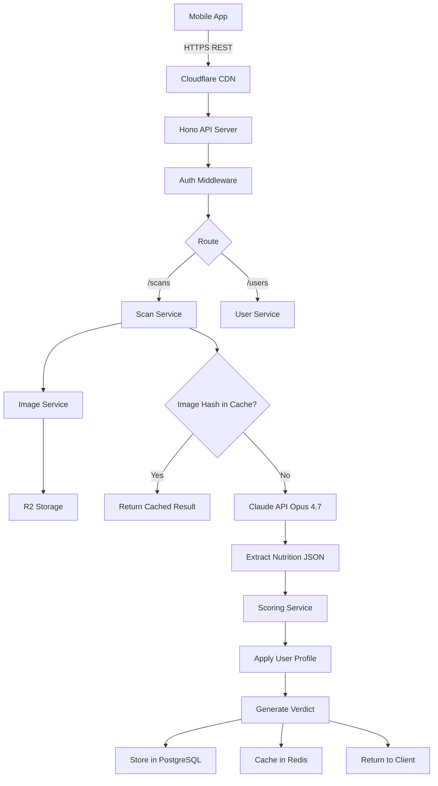

# nt-checker — System Architecture

**Date:** 2026-05-11
**Status:** Draft v1

---

## 1. High-Level Architecture

```
┌─────────────────────────────────────────────────────────────────┐
│                          CLIENT LAYER                            │
├─────────────────────────────────────────────────────────────────┤
│                                                                  │
│   ┌──────────────────┐         ┌──────────────────┐             │
│   │   Mobile App     │         │    Web App       │             │
│   │  (React Native)  │         │   (Next.js 15)   │             │
│   │   iOS / Android  │         │   (Admin/Web)    │             │
│   └────────┬─────────┘         └────────┬─────────┘             │
│            │                            │                        │
└────────────┼────────────────────────────┼────────────────────────┘
             │                            │
             │      HTTPS / REST + JWT    │
             │                            │
             ▼                            ▼
┌─────────────────────────────────────────────────────────────────┐
│                        API GATEWAY LAYER                         │
├─────────────────────────────────────────────────────────────────┤
│                                                                  │
│   ┌────────────────────────────────────────────────────────┐    │
│   │  Cloudflare (CDN + DDoS + WAF)                         │    │
│   └────────────────────┬───────────────────────────────────┘    │
│                        │                                         │
│   ┌────────────────────▼───────────────────────────────────┐    │
│   │  Rate Limiter (Upstash Ratelimit)                      │    │
│   └────────────────────┬───────────────────────────────────┘    │
└────────────────────────┼─────────────────────────────────────────┘
                         │
                         ▼
┌─────────────────────────────────────────────────────────────────┐
│                      APPLICATION LAYER                           │
├─────────────────────────────────────────────────────────────────┤
│                                                                  │
│   ┌─────────────────────────────────────────────────────────┐   │
│   │   Hono API Server (Node.js / Bun) — TypeScript          │   │
│   │                                                          │   │
│   │   ┌──────────┐ ┌──────────┐ ┌──────────┐ ┌──────────┐  │   │
│   │   │  Auth    │ │  Users   │ │  Scans   │ │ Products │  │   │
│   │   │ Routes   │ │ Routes   │ │ Routes   │ │ Routes   │  │   │
│   │   └──────────┘ └──────────┘ └──────────┘ └──────────┘  │   │
│   │                                                          │   │
│   │   ┌─────────────────────────────────────────────────┐   │   │
│   │   │  Services Layer                                  │   │   │
│   │   │  • AnalysisService  • ScoringService             │   │   │
│   │   │  • UserService      • ImageService               │   │   │
│   │   └─────────────────────────────────────────────────┘   │   │
│   └──────┬──────────────────────────────────────┬───────────┘   │
│          │                                       │               │
└──────────┼───────────────────────────────────────┼───────────────┘
           │                                       │
           ▼                                       ▼
┌──────────────────────┐              ┌──────────────────────────┐
│   AI / VISION LAYER  │              │     DATA LAYER           │
├──────────────────────┤              ├──────────────────────────┤
│                      │              │                          │
│  ┌────────────────┐  │              │  ┌────────────────────┐  │
│  │  Claude API    │  │              │  │  PostgreSQL        │  │
│  │  Opus 4.7      │  │              │  │  (Supabase)        │  │
│  │  Vision + LLM  │  │              │  │  • users           │  │
│  └────────────────┘  │              │  │  • profiles        │  │
│                      │              │  │  • scans           │  │
│  ┌────────────────┐  │              │  │  • products        │  │
│  │ Fallback APIs  │  │              │  │  • allergens       │  │
│  │ • GPT-4o       │  │              │  └────────────────────┘  │
│  │ • Gemini       │  │              │                          │
│  └────────────────┘  │              │  ┌────────────────────┐  │
│                      │              │  │  Redis (Upstash)   │  │
│  ┌────────────────┐  │              │  │  • image hash      │  │
│  │ Google Vision  │  │              │  │  • session cache   │  │
│  │ (OCR Fallback) │  │              │  │  • rate limits     │  │
│  └────────────────┘  │              │  └────────────────────┘  │
│                      │              │                          │
└──────────────────────┘              │  ┌────────────────────┐  │
                                      │  │  R2 / S3 Storage   │  │
                                      │  │  • uploaded images │  │
                                      │  └────────────────────┘  │
                                      └──────────────────────────┘

┌─────────────────────────────────────────────────────────────────┐
│                      EXTERNAL SERVICES                           │
├─────────────────────────────────────────────────────────────────┤
│  • Open Food Facts API   (nutrition reference data)              │
│  • Stripe / Xendit       (payments)                              │
│  • Resend                (transactional email)                   │
│  • Sentry                (error tracking)                        │
│  • PostHog               (analytics)                             │
└─────────────────────────────────────────────────────────────────┘
```

---

## 2. Component Breakdown

### 2.1 Client Layer

**Mobile App (Primary)**
- React Native + Expo
- Camera capture, image upload, scan results UI
- Local cache (MMKV) for offline scan history

**Web App (Secondary)**
- Next.js for marketing site + admin panel
- Optional: web-based scanning via webcam

### 2.2 API Gateway Layer

- **Cloudflare** — CDN, DDoS protection, WAF
- **Rate Limiter** — Upstash Ratelimit (per IP + per user)
- **Auth Middleware** — JWT verification

### 2.3 Application Layer

**Hono API Server** with route groups:
- `/auth` — signup, login, refresh, logout
- `/users` — profile CRUD, health conditions, preferences
- `/scans` — create scan, list, get details, delete
- `/products` — search, barcode lookup, alternatives

**Services Layer:**
- `AnalysisService` — orchestrates Claude API calls for extraction
- `ScoringService` — applies health scoring rules
- `UserService` — profile management, personalization logic
- `ImageService` — upload, preprocessing, hash-based dedup

### 2.4 AI / Vision Layer

- **Claude Opus 4.7** — primary vision-LLM for extraction + verdict explanation
- **GPT-4o / Gemini** — fallback providers
- **Google Cloud Vision** — backup OCR for cases where vision-LLM has low confidence

### 2.5 Data Layer

- **PostgreSQL (Supabase)** — relational store
- **Redis (Upstash)** — cache + rate limiting
- **R2 / S3** — image object storage

---

## 3. Key Data Flow — Scan to Verdict

```
┌──────────┐                                                          ┌──────────┐
│  Mobile  │                                                          │  Claude  │
│   App    │                                                          │   API    │
└────┬─────┘                                                          └────┬─────┘
     │                                                                     │
     │  1. Capture image of nutrition label                                │
     │ ─────────────────────────────────                                   │
     │                                                                     │
     │  2. POST /scans (multipart: image + userId)                         │
     │ ───────────────────────────────────────────────►                    │
     │                  ┌──────────────────┐                               │
     │                  │  API Server      │                               │
     │                  └────────┬─────────┘                               │
     │                           │                                         │
     │                           │  3. Upload image → R2 (get URL)         │
     │                           │  4. Compute image hash                  │
     │                           │  5. Check Redis cache (hash hit?)       │
     │                           │                                         │
     │                           │  6a. Cache HIT → return cached result   │
     │                           │  6b. Cache MISS:                        │
     │                           │      ─ Call Claude API w/ image ───────►│
     │                           │                                         │
     │                           │      ◄──── Structured JSON ─────────────│
     │                           │      (nutrition + ingredients)          │
     │                           │                                         │
     │                           │  7. Run ScoringService                  │
     │                           │      ─ Apply user profile               │
     │                           │      ─ Apply health rules               │
     │                           │      ─ Generate verdict                 │
     │                           │                                         │
     │                           │  8. Store scan in PostgreSQL            │
     │                           │  9. Cache result in Redis               │
     │                           │                                         │
     │  10. Response: verdict + breakdown + explanation                    │
     │ ◄──────────────────────────────────────────────                     │
     │                                                                     │
     │  11. Render verdict card                                            │
     │                                                                     │
```

---

## 4. Sequence Diagram — User Authentication

```
┌────────┐      ┌──────────┐     ┌──────────┐     ┌──────────┐
│ Mobile │      │   API    │     │   DB     │     │  Redis   │
└───┬────┘      └────┬─────┘     └────┬─────┘     └────┬─────┘
    │                │                 │                │
    │  POST /auth/login (email, pw)    │                │
    │ ──────────────►                  │                │
    │                │  SELECT user    │                │
    │                │ ──────────────► │                │
    │                │ ◄────────────── │                │
    │                │  Verify bcrypt  │                │
    │                │                 │                │
    │                │  Issue JWT + refresh token       │
    │                │  Store refresh in Redis ───────► │
    │                │                                  │
    │  200 { access, refresh }         │                │
    │ ◄────────────── │                │                │
    │                 │                │                │
    │  Subsequent requests with Bearer access token     │
    │ ──────────────► │                │                │
    │                 │  Verify JWT signature           │
    │                 │  (no DB hit needed)             │
```

---

## 5. Database Schema (Simplified)

```
┌────────────────────┐     ┌────────────────────┐
│      users         │     │     profiles       │
├────────────────────┤     ├────────────────────┤
│ id (uuid) PK       │◄────┤ user_id FK         │
│ email              │     │ age                │
│ password_hash      │     │ gender             │
│ created_at         │     │ weight_kg          │
│ subscription_tier  │     │ height_cm          │
└─────────┬──────────┘     │ activity_level     │
          │                │ conditions[] (jsonb)│
          │                │ allergies[] (jsonb) │
          │                │ goals[]    (jsonb)  │
          │                └────────────────────┘
          │
          │
┌─────────▼──────────┐     ┌────────────────────┐
│      scans         │     │     products       │
├────────────────────┤     ├────────────────────┤
│ id (uuid) PK       │     │ id (uuid) PK       │
│ user_id FK         │     │ barcode            │
│ product_id FK NULL │────►│ name               │
│ image_url          │     │ brand              │
│ image_hash         │     │ category           │
│ nutrition (jsonb)  │     │ nutrition (jsonb)  │
│ ingredients (jsonb)│     │ ingredients (jsonb)│
│ verdict            │     │ created_at         │
│ score              │     └────────────────────┘
│ explanation        │
│ created_at         │
└────────────────────┘
```

---

## 6. Deployment Topology

```
                    ┌──────────────────────┐
                    │   App Store / Play   │
                    │     (Mobile App)     │
                    └──────────┬───────────┘
                               │
                               │ Expo EAS Updates (OTA)
                               │
                               ▼
                ┌──────────────────────────────┐
                │      Cloudflare DNS + CDN    │
                └──────────────┬───────────────┘
                               │
              ┌────────────────┼────────────────┐
              │                │                │
              ▼                ▼                ▼
       ┌─────────────┐  ┌─────────────┐  ┌─────────────┐
       │  Vercel     │  │  Railway    │  │  Cloudflare │
       │  (Web)      │  │  (API)      │  │  R2 (images)│
       └─────────────┘  └──────┬──────┘  └─────────────┘
                               │
                  ┌────────────┼────────────┐
                  ▼            ▼            ▼
           ┌──────────┐ ┌──────────┐ ┌──────────────┐
           │ Supabase │ │ Upstash  │ │  Anthropic   │
           │ Postgres │ │  Redis   │ │  Claude API  │
           └──────────┘ └──────────┘ └──────────────┘
```

---

## 7. Mermaid Diagram (for renderers)



---

## 8. Scalability Considerations

| Concern | Strategy |
|---------|----------|
| **High vision API cost** | Image hash dedup → cache verdicts; prompt caching on the template |
| **Burst traffic** | Rate limiting per user; queue heavy LLM calls if needed |
| **Latency** | Stream Claude response; show skeleton UI while waiting |
| **Image storage growth** | Lifecycle policy: delete raw images after N days, keep extracted JSON |
| **DB read load** | Replica for read-heavy queries; cache hot products in Redis |
| **Multi-region** | Start single-region (Singapore for SEA); add regions as user base expands |

---

## 9. Security Architecture

| Layer | Control |
|-------|---------|
| **Transport** | TLS 1.3 everywhere |
| **API** | JWT with short TTL (15 min) + refresh tokens (7 days) |
| **Storage** | Encryption at rest (Postgres TDE, R2 default) |
| **Secrets** | Never in code; Doppler / environment variables |
| **PII** | Health data encrypted column-level for `profiles.conditions` |
| **Image privacy** | Signed URLs with short TTL for image access |
| **Compliance** | GDPR-style data export + delete; user owns their data |

---

*End of architecture document.*
